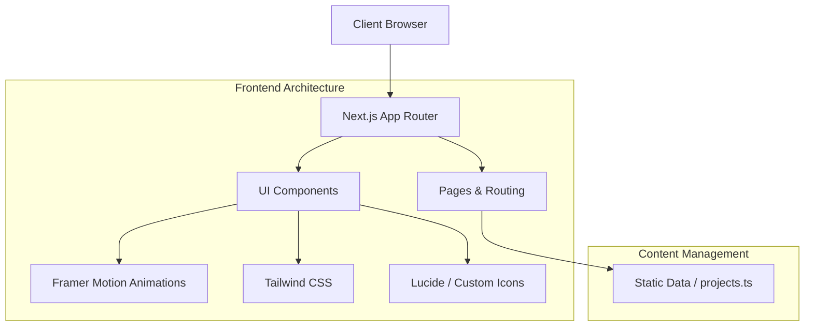

# Punya's Digital Portfolio


A minimalist, highly responsive personal portfolio website built with modern web technologies.

## Key Features

- **Responsive Design:** Fully fluid layouts tailored for both mobile and desktop views using Tailwind CSS.
- **Micro-Animations:** Fluid, interactive motion states powered by Framer Motion.
- **Server-Side Rendering:** Utilizing Next.js App Router for optimal load times and SEO.
- **Static Content Handling:** Well-defined type-safe static content pipeline.
- **Type Safety:** 100% written in TypeScript for predictable, bug-free behavior.

## Architecture



## Project Structure

- `src/app/` - Next.js 15 App Router pages, global layouts, and endpoints.
- `src/components/` - Reusable UI sections, specific widgets & Framer modules (e.g. `Projects.tsx`, `Header.tsx`).
- `src/data/` - Flat file static assets containing data strings & definitions (like `projects.ts`).
- `src/lib/` - Shared helper functions and utility integrations (e.g. `utils.ts`).
- `src/context/` - React Context providers globally mounted to handle things like Theme contextual state.

## Tech Stack

- **Framework:** Next.js 15 (App Router)
- **Language:** TypeScript
- **Styling:** Tailwind CSS
- **Animations:** Framer Motion, Rough Notation
- **Icons:** Lucide React
- **Data Fetching/State:** SWR, React Query

## Local Setup

### Prerequisites
- Node.js 18+
- npm or yarn

### Installation

1. **Clone the repository:**
   ```bash
   git clone <repository-url>
   cd portfolio_pj
   ```

2. **Install dependencies:**
   ```bash
   npm install
   ```

3. **Start the development server:**
   ```bash
   npm run dev
   ```

4. Open [http://localhost:3000](http://localhost:3000) in your browser.

## Available Scripts

- `npm run dev` - Starts the development server.
- `npm run build` - Creates an optimized production build.
- `npm run start` - Starts the production server.
- `npm run lint` - Runs ESLint to check for code issues.

## Customization

To make this your own:

1. Update `src/data/projects.ts` with your own project metadata, URLs, and skills.
2. Edit the hero section bio and work history in `src/app/page.tsx` or respective components (e.g. `Experience.tsx`, `Education.tsx`).
3. Replace the placeholder resume/social links across the top `Navbar.tsx` and `Footer.tsx`.

## Deployment

The easiest way to deploy your Next.js app is to use the [Vercel Platform](https://vercel.com/new).

1. Push your code to a GitHub repository.
2. Import the project into Vercel.
3. Vercel will automatically detect the Next.js framework and configure the build settings.
4. Click **Deploy**.

For more details, check out the [Next.js deployment documentation](https://nextjs.org/docs/app/building-your-application/deploying).
